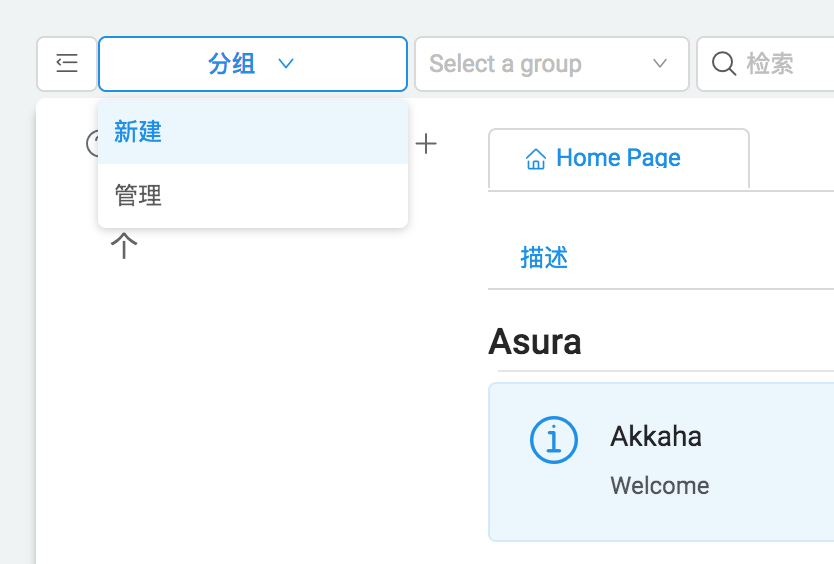
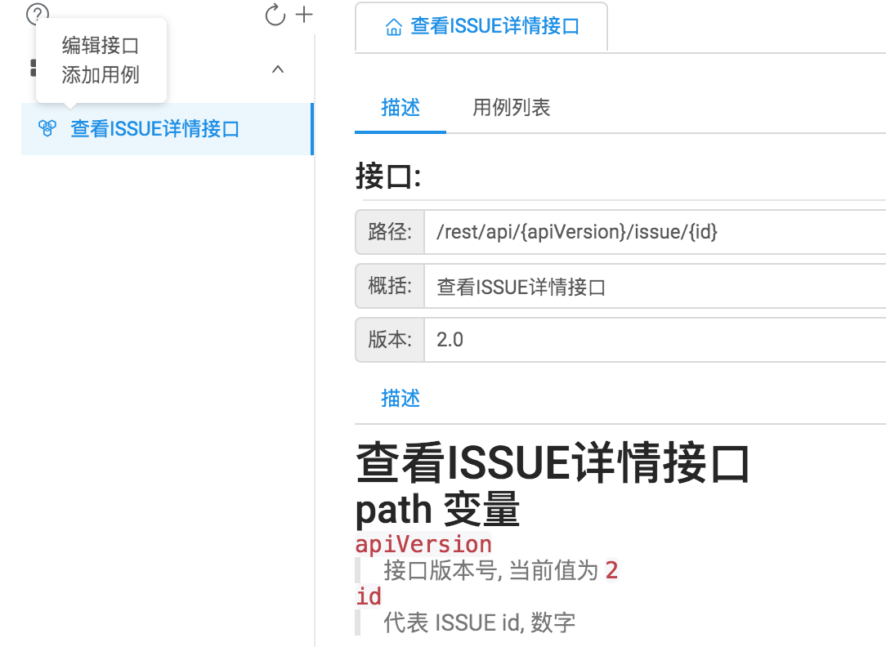
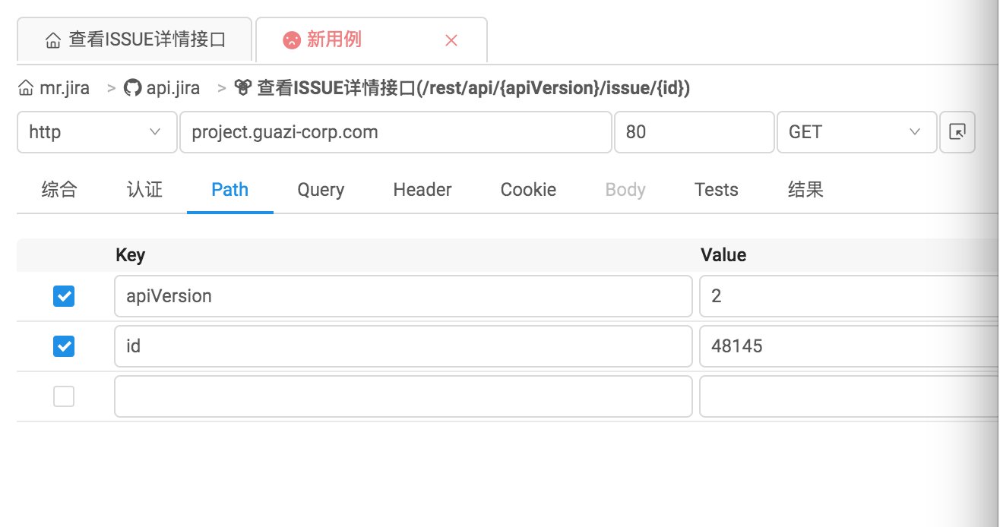
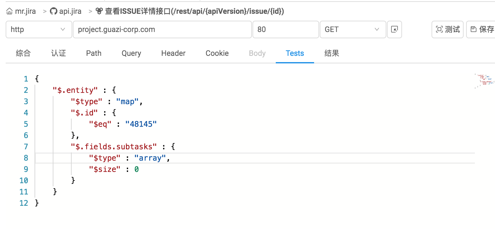
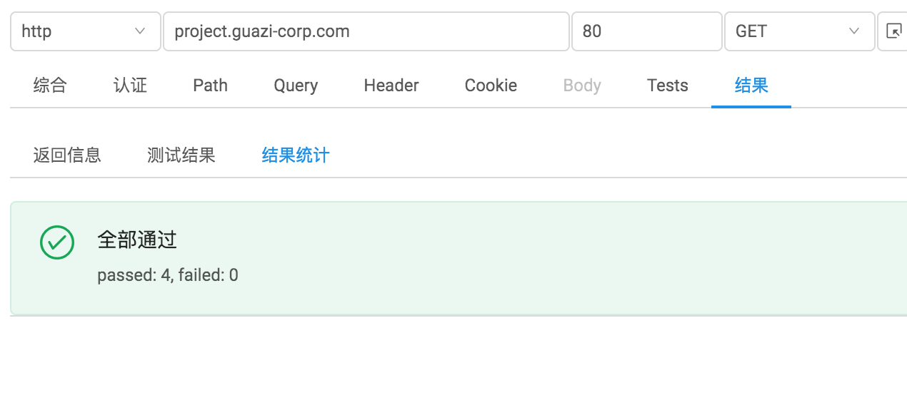

# 创建用例

## 新建分组

- 点击新建按钮

- 填写信息

## 创建项目

- 点击新建项目

## 添加接口

- 点击添加接口

- 填写接口信息

## 添加用例

- 点击添加用例

- 添加用例信息
  - 填写 `path` 变量
  
  - 点击测试按钮, 可查看返回信息
  - 编写断言, 规则[参考](/assert)
  
  - 点击测试,可得到断言结果;点击保存该用例会持久化
  