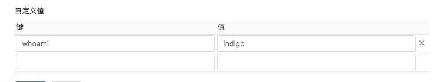
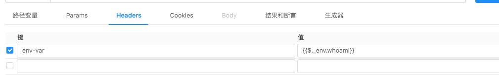
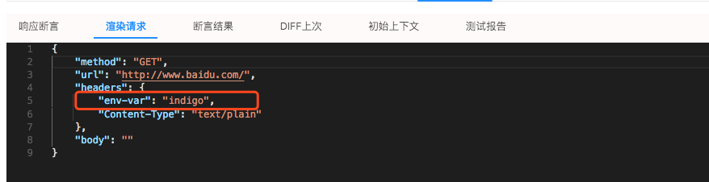
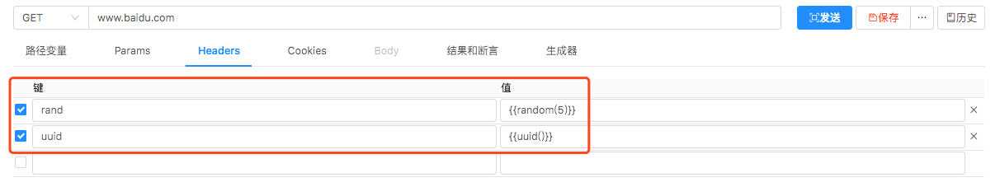
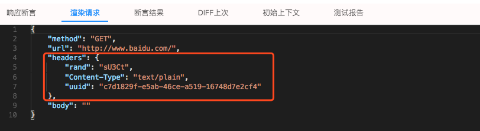
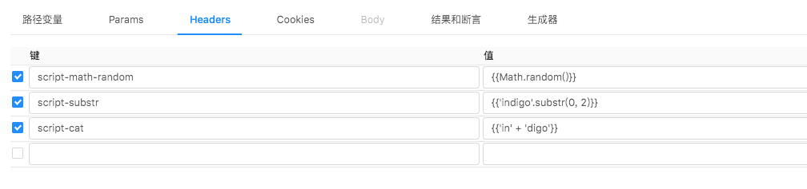
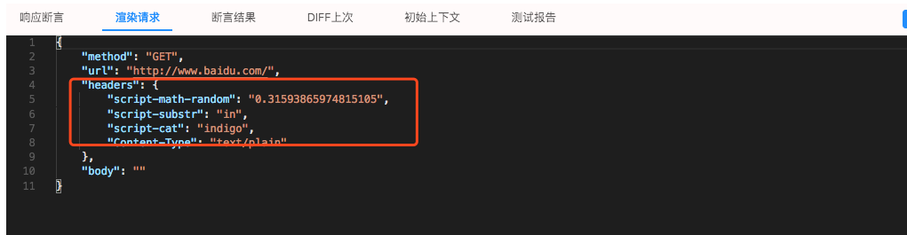

# 使用变量和函数

> 俺把用例看成是一个模板。执行时的数据可以进行动态渲染。启用模板渲染功能的标志是用 `{{` 和 `}}` 包起来的字符串。
> 渲染的数据来源有两种一种是来自[执行上下文](/zh-cn/context)，另一种是由函数、脚本生成。

## 引用 执行上下文 中的数据

> 都是 [JsonPath](https://goessner.net/articles/JsonPath/) 表达式。以 `$.` 或 `$[` 开头。

### 引用环境配置中的变量

> 假设应用了这个环境配置
> 

> `{{$._env.whoami}}` 中 `$._env` 就是引用环境配置中的变量。
> 
> 

## 函数、脚本生成

> 使用[内置函数](/zh-cn/function)。下面在 `Headers` 里面加了 `rand` 和 `uuid` 两个消息头。
> 
> 

> 使用任意 JavaScript 脚本（[Nashorn](https://en.wikipedia.org/wiki/Nashorn_(JavaScript_engine))）
> 
> 
