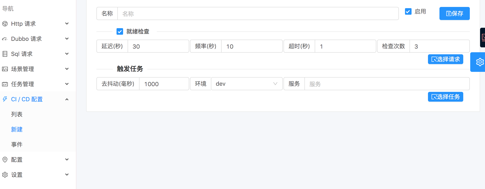

# 持续集成

> 简单来说就是通过, 接口和消息队列来触发 `indigo` 中的任务. 有两种类型, 一种是通过 `任务ID` 直接调用接口, 一种是通过提前设置 `触发器` 来触发.

## 通过任务ID调用

> 前提得知道任务ID,只能执行单个任务. 都是同步的接口, 会不断输出.

- SSE 接口

`http(s)://{address}/api/ci/job/${jobId}` 可直接通过 `curl` 调用

- Websocket 接口

`ws(s)://{address}/api/ci/ws/job/${jobId}`

## 触发器

> 可以触发满足条件的多个任务

### 事件源

```scala
case class CiTriggerEventMessage(
                                  group: String,
                                  project: String,
                                  env: String,
                                  author: String,
                                  service: String,
                                  `type`: String,
                                  timestamp: Long,
                                )
```

- 调用 `POST /api/ci/trigger`

> 直接通过 HTTP 发送事件.

- 调用 `CiManager#eventSource(msg: CiTriggerEventMessage)` 函数

> 通过代码调用, 如: kafka 消费者

### 设置触发器

> 

#### `就绪检查`

> 指执行任务之前, 先执行个请求检查目标服务是否可用. 如监听 K8S Pod 的启动消息后, 可能服务还没有真正启动起来.

#### `触发任务`

> 设置触发任务的条件. 每个事件消息可以生成个 `Key: ${group}:${project}:${env}:${service}`, 如果相同 `Key` 的消息在 `去抖动` 时间范围内收到, 就当成一次事件. 如: K8S 中同一个服务的多个 POD 的事件.

# 报告

> 每次事件都会关联任务及报告.
