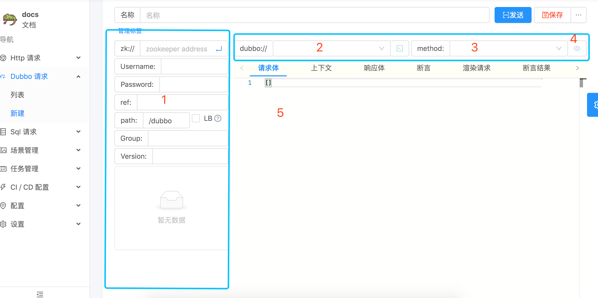

# Dubbo

> 实现基于 `Dubbo` 自身的 [泛化调用](http://dubbo.apache.org/zh-cn/docs/user/demos/generic-reference.html), 可以不依赖 Java 的 `Interface` 接口, 就发起泛化请求. 可以查看文档, 查看详细内容. 这种实现方式有种缺点, 就是有的 Java 类型无法泛化 如: `LocalDateTime`

## 快速开始

### 框1

- zk://
> `非必须`. zookeeper 的连接串, 最好用多个机器节点. `点击` 右边的按钮, 可以自动解析出 zk 中现有的 `服务`.

- Username:
> `非必须`. zookeeper 的指定路径的用户名.

- Password:
> `非必须`. zookeeper 的指定路径的密码.

- ref:
> `必须`. Java `Interface` 接口的全引用名称.

- path:
> `非必须`. zookeeper dubbo 使用的跟路径. 默认 `/dubbo`.

- LB:
> 选中后, 会自动从 zookeeper 中随机选择一个节点执行请求. 如果这个被选择, `zk://` 必填.

- Group:
> `非必须`. dubbo 接口的 `group`.

- Version:
> `非必须`. dubbo 接口的 `version`.

### 框2
> `Provider` 的 `ip` 和 `端口号`. 点击右边的按钮, 可以直接 `Telnet` 到 `Provider`. 可通过选择左边的接口, 进行推荐.

### 框3
> 接口中有哪些方法, 右边的按钮是.

### 框4
> 参数的类型列表.

### 框5
> 请求体, JSON 数组. 为什么会这样, 参考: [泛化调用](http://dubbo.apache.org/zh-cn/docs/user/demos/generic-reference.html)

## 原理

> 通过 `Dubbo` 框架本身提供的 [泛化调用](http://dubbo.apache.org/zh-cn/docs/user/demos/generic-reference.html) 采用 `点对点直连` 的方式直接调用 `Provider`.

## 示例
