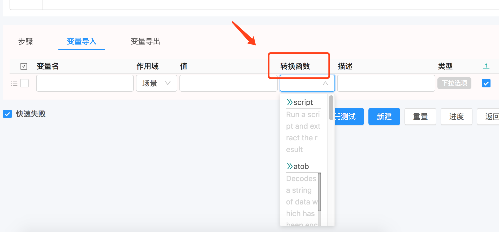

# 内置函数

# 模板函数

> 可以直接在模板里面使用, 可以自行扩展

## random(count)

> 生成 `count` 个随机字符串.

## uuid()

> 生成 `UUID` 字符串.

## randomAlphabetic(count)

> 生成 `count` 个随机字母的字符串.

## randomNumeric(count)

> 生成 `count` 个随机数字的字符串.

## btoa

> base64 编码. 如: `btoa('a')` 返回字符串 `YQ==`

## atob

> base64 解码. 如: `atob('YQ==')` 返回字符串 `a`

# 转换函数

> 用于场景中 `导入` 和 `导出` 时对值进行个函数转换, 把结果放到上下文中. 可以自行扩展.

> 

## atob

> 对输入进行 base64 解码

## btoa

> 对输入进行 base64 编码

## script

> 对输入执行段脚本

## toInteger

> 转换成 `Integer` 类型

## toLong

> 转换成 `Long` 类型

## toMap

> 字符串转换成 `Map`(jackson)

## toString

> 任意类型转换成 `String`(jackson)
