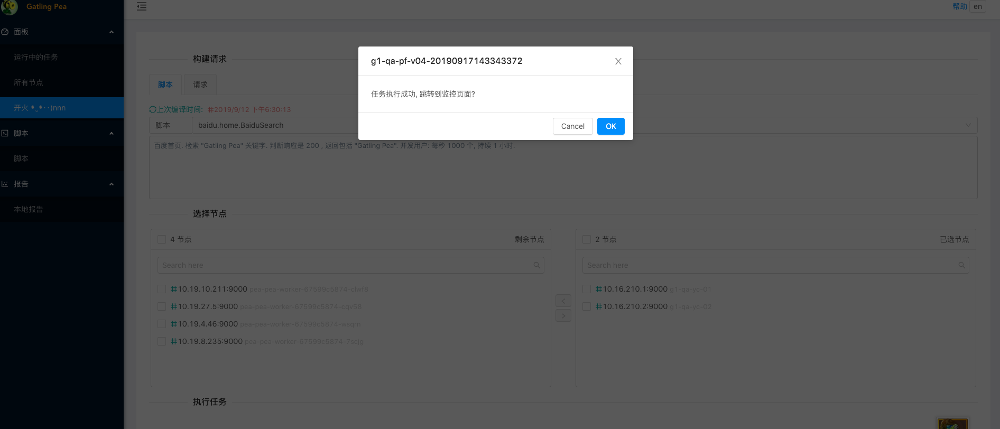

# 快速开始

## 1. 选择要执行的脚本或请求
> 脚本适合比较复杂的场景, 除了 `HTTP` 协议, 还支持 `Dubbo` 和 `Grpc` 协议. 其他协议可以扩展.

## 2. 选择使用哪些工作节点
> 每个节点会执行相同的任务

## 3. 执行任务

> 

## 4. 进入任务实时监控界面

> 
> 

## 5. 执行完后的完整报告

> 场景中所有请求的概括
> 

> 单独每个请求的信息
> 
