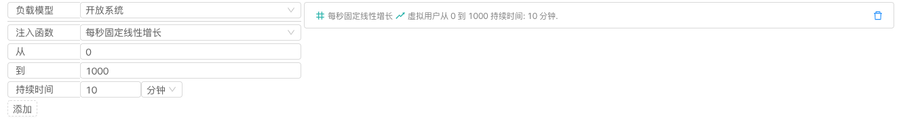
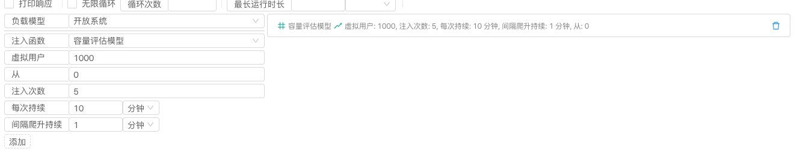
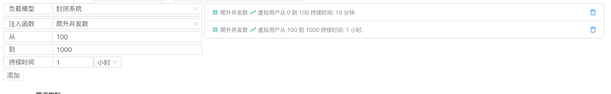
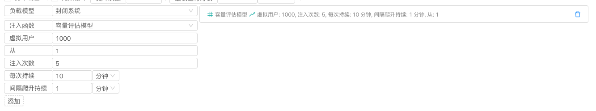
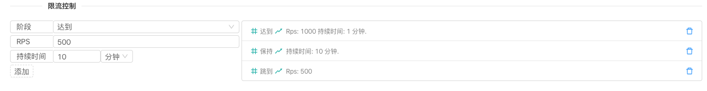

# 发压模型

> 原版 https://gatling.io/docs/current/general/simulation_setup/#injection

> 可以组合多个 `注入函数`. ⚠️ 注意下面的配置都是针对单个节点的参数.

# 循环配置

> 可以设置下面的一组注入函数的循环次数. 可以设置一直循环执行并设置个最长执行时间

# 开放系统

> 大部分系统属于这种. 这个模式下, 会按着注入函数创建新的链接(发送新的请求), 不关心目标系统的承受能力和之前的虚拟用户请求是否返回.

## 等待时长

## 一次性注入

## 线性增长

## 每秒固定并发

## 每秒固定线性增长

## 阶跃函数增长

## 容量评估模型

# 封闭系统

> 如: 客服呼叫中心, 整个系统会有固定的座机数, 固定的满承载能力. 这种模式下, 引擎会一直维持着虚拟用户数(链接数, 请求数)在指定值. 不会像开放系统那样不断的注入新的虚拟用户.

## 固定并发数

## 爬升并发数

## 容量评估模型

# 限流控制

> 可以限制 rps 的值, 上面的例子是, 1. 如果在 1分钟内rps到了1000 2. 维持 1000rps 10分钟 3. 调整 rps 到 500
