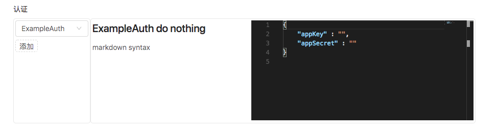
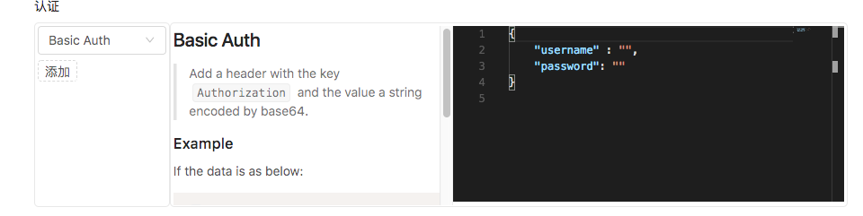

# 自定义认证方式和任务通知

> 目前的基本实现需要依赖 Playframeword 的 Modules 机制 https://www.playframework.com/documentation/2.6.x/Modules 。
> 可以自己生成 jar 放到 lib 文件夹下，参考 https://www.playframework.com/documentation/2.6.x/SBTDependencies#Managing-library-dependencies 

> 下面的例子是在源码的基础上建一个单独的子项目的方式
> 参考项目：https://github.com/asura-pro/indigo-api/tree/master/asura-example/

> Commit：https://github.com/asura-pro/indigo-api/commit/25adb4eb537a85c5ab89cf2923067b6fd7dccaef

## 自定义认证及签名

### 实现 `AuthorizeAndValidate`
```scala
trait AuthorizeAndValidate {

  // 认证类型的ID, 整个系统需要唯一
  val `type`: String
  // 描述，markdown 语法
  val description: String
  // 数据模板，默认值，需要是 json 类型
  val template: String = "{}"

  // 签名逻辑实现，第一个 `request` 是原始的请求, `auth` 是本身签名算法需要的 数据，函数返回一个加密/签名后的请求
  def authorize(request: HttpRequest, auth: Authorization): Future[HttpRequest]

  // 本签名实现依赖的数据有效性的验证函数
  def validate(auth: Authorization): BoolErrorRes
}
```

### 例子1

> https://github.com/asura-pro/indigo-api/blob/master/asura-example/src/main/scala/com/example/asura/auth/ExampleAuth.scala

```scala
// config 是所有的配置，自定义的配置可以添加到应用的配置文件中
class ExampleAuth(config: Configuration) extends AuthorizeAndValidate {
  override val `type`: String = "ExampleAuth"
  override val description: String =
    """# ExampleAuth do nothing
      |markdown syntax
    """.stripMargin
  override val template: String =
    """{
      |    "appKey" : "",
      |    "appSecret" : ""
      |}
    """.stripMargin

  override def authorize(request: HttpRequest, auth: Authorization): Future[HttpRequest] = {
    Future.successful(request)
  }
  override def validate(auth: Authorization): (Boolean, String) = (true, null)
}
```
> 上面这个实现实际上什么都没做。在前端会增加这样
> 

### 例子2 Basic Access Authentication

> 定义：https://en.wikipedia.org/wiki/Basic_access_authentication

> https://github.com/asura-pro/indigo-api/blob/master/asura-app/app/asura/app/api/auth/BasicAuth.scala

<pre style="font-size:smaller;">
object BasicAuth extends AuthorizeAndValidate {
  override val `type`: String = "Basic Auth"
  override val description: String =
    """## Basic Auth
      |> Add a header with the key `Authorization` and the value a string encoded by base64.
      |
      |### Example
      |
      |If the data is as below:
      |
      |```json
      |{
      |    "username" : "a",
      |    "password": "b"
      |}
      |```
      |
      |A header `Authorization: Basic YTpi` will be added. `YTpi` is generated by call `Base64.encode("a:b")`.
      |
    """.stripMargin
  override val template: String =
    """{
      |    "username" : "",
      |    "password": ""
      |}
    """.stripMargin
  override def authorize(request: HttpRequest, auth: Authorization): Future[HttpRequest] = {
    val username = auth.data.get("username")
    val password = auth.data.get("password")
    val bytes = Base64.getEncoder.encode(s"${username.get}:${password.get}".getBytes(StandardCharsets.UTF_8))
    val value = new String(bytes, StandardCharsets.UTF_8)
    Future.successful(request.withHeaders(request.headers :+ RawHeader("Authorization", s"Basic ${value}")))
  }
  override def validate(auth: Authorization): (Boolean, String) = {
    val username = auth.data.get("username")
    val password = auth.data.get("password")
    if (username.isEmpty || password.isEmpty) {
      (false, "username and password can't be empty")
    } else {
      (true, null)
    }
  }
}
</pre>
> 

## 自定义任务通知

### 实现 `JobNotifyFunction`

```scala
trait JobNotifyFunction {
  /** id for every type of notification mechanism */
  val `type`: String
  val description: String

  def notify(execDesc: JobExecDesc, subscriber: JobNotify): Future[NotifyResponse]
}
```

### 例子

>https://github.com/asura-pro/indigo-api/blob/master/asura-example/src/main/scala/com/example/asura/notify/ExampleNotification.scala

## 自定义断言类型

### 实现 `Assertion`
```scala
trait Assertion {

  val description = StringUtils.EMPTY
  val name: String
  // 实际值和期望值
  def assert(actual: Any, expect: Any): Future[AssertResult]
}
```

### 例子

```scala
// 总是通过
object ExampleAssertion extends Assertion {

  override val name: String = "$example"
  override val description: String = ""

  override def assert(actual: Any, expect: Any): Future[AssertResult] = {
    Future.successful(PassAssertResult())
  }
}
```

> 系统自带实现的一些 https://github.com/asura-pro/indigo-api/tree/master/asura-core/src/main/scala/asura/core/cs/assertion