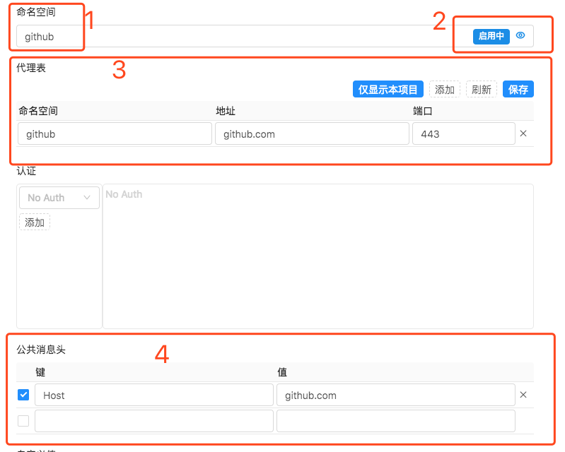
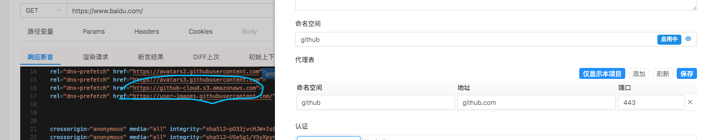
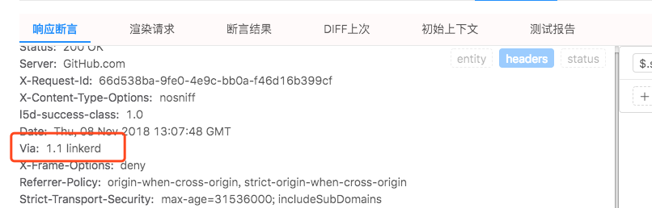

### 控制请求发送到什么环境

> 代理的支持配置在 `环境配置` 上。第一个按钮是查看或新建一个环境配置，第二个按钮是选择一个已经存在的环境配置。

> 

#### 指定命名空间和对应的地址和端口号

> `1.` 中的命名空间及请求的环境名称和代理表中的一致，默认情况下 `代理表` 是隐藏的，点 `2.` 中右边那个像眼睛的按钮即可显示。`命名空间` 中的名字任意字符串且代理表中需要有一条相同名字的命名空间。实际执行中这个名字会匹配到`代理表`中本项目下有相同名字的那条代理记录。

> 要启用环境配置中的代理功能需要 `2.` 中的按钮状态是 `启用中`

> `3.` 中的代理表是个独立的全局组件，修改后需要及时点击内部的 `保存`。注意如果需要是相同的协议，如果用例请求中用的是 `https`， 代理的服务端口也需要支持 `https`。`命名空间` 字段为任意字符串，`地址`字段为实际请求的 `域名` 或 `IP`。

> `4.` 中的 `公共消息头` 会在使用该环境配置的所有请求里面把表里面的信息添加到 请求头 中, 这个例子中添加 `Host` 的目的是有的服务在 Nginx 后面，Nginx 的 `server_name` 配置需要通过 `Host` 消息头来匹配对应的服务。

> 

#### 判断请求确实通过了代理

> 上面的例子中，用例中请求的是 `https://www.baidu.com/` 代理中配的是访问 `github.com`。响应的消息头中会有一个 `Via:1.1 linkerd` 的记录。

> 
> 
