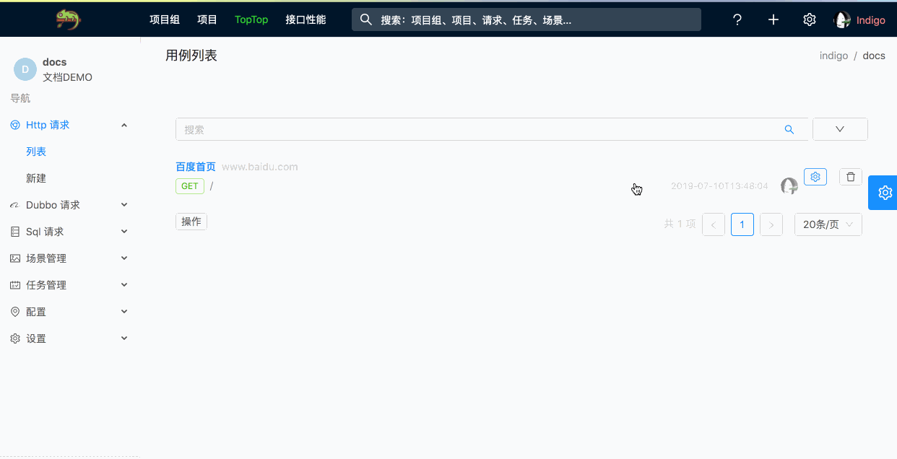
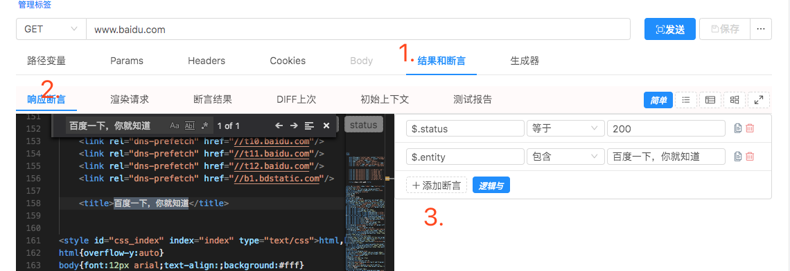
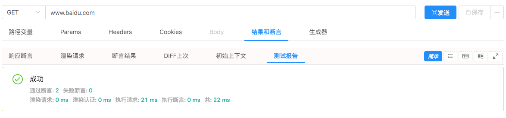
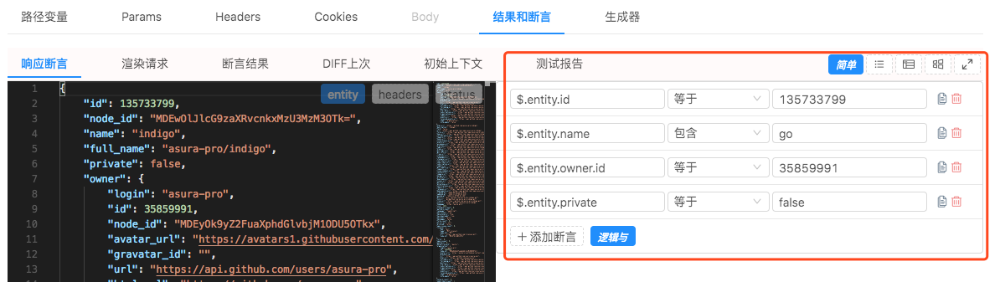
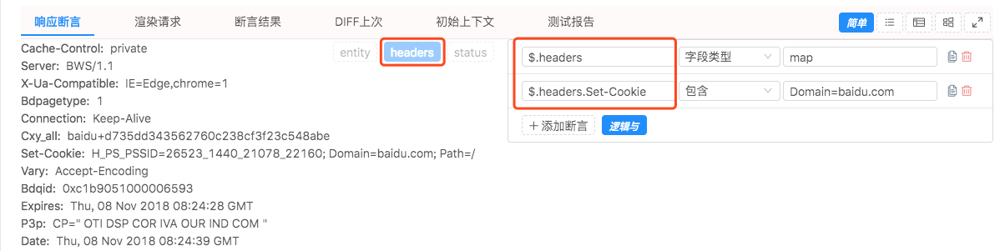

# 添加断言

[查看所有断言参考和内部实现机制](/zh-cn/assertion.md)

> 可先点击一下发送,然后在标签页 `结果和断言`->`响应断言` 中的面板 `3` 处添加断言.
> 

## 响应消息码

> 上图中第一条断言断言响应码为 `200`,`$.status` 可以指定响应码.

## 非 Json 响应消息体

> 响应体的类型可以划分为 `json` 和 `非json` 类型.

> 上图中的示例是一个 `GET` 请求,响应体为 `HTML(非json)` 类型,第二条断言就是断言响应体中包含 `百度一下,你就知道` 这个字符串.

> 添加完断言后,在点击下 `发送` 按钮.可以看到这个用例请求的测试报告.
> 

## Json 响应消息体

> 
> 左边的 `$.` 开头的是 [JsonPath](https://goessner.net/articles/JsonPath/),`entity` 代表响应的消息体,基本原则就是使用 `JsonPath` 选定Json结构体的子属性,然后后面进行相应的断言.

## 响应消息头

> 
> `$.headers` 代表响应头对象.
