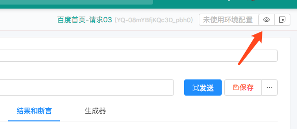
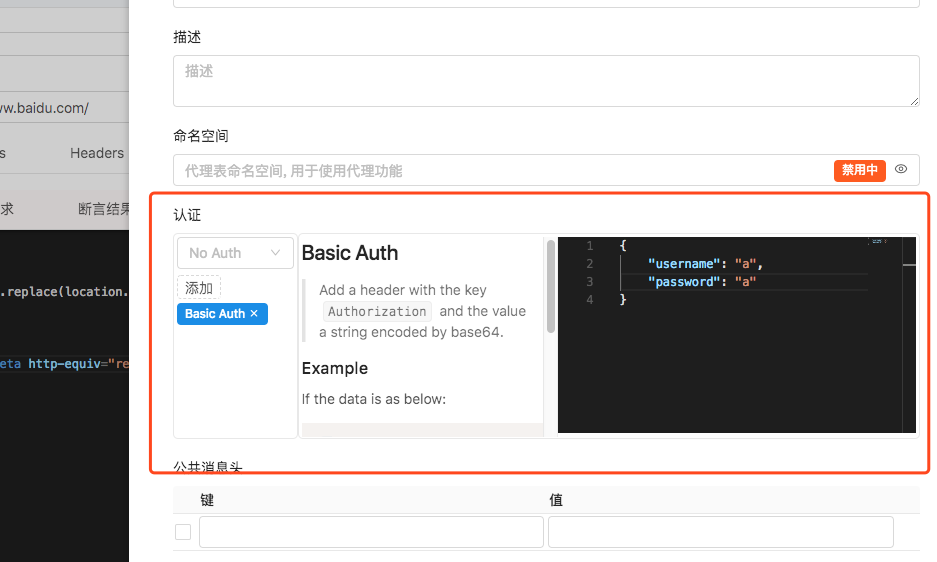

### 自动添加签名

> 从安全方面考虑,接口请求都需要进行签名,通过签名来验证请求的发起者（人或机器）的真实性.签名算法一般会生成一个签名`token`.
> `token`的表现形式多样,可能是URL中的某个变量值（`sign`、`token`）,也可能是请求Header（`token`, `Authorization`）或Cookie（`token`、`sso`）中的某个值.签名算法会自动根据请求中的一些变量（有的不需要）,和额外的参数（`appkey`,`appsecret` 等,有的不需要）生成签名,在构造请求时可以不用关心这些变量.

> 签名的支持配置在 `环境配置` 上.第一个按钮是查看或新建一个环境配置,第二个按钮是选择一个已经存在的环境配置.

> 

#### 选择认证算法

> 系统内置了一些签名算法的支持.如果选择多个,会依次执行.

> 
