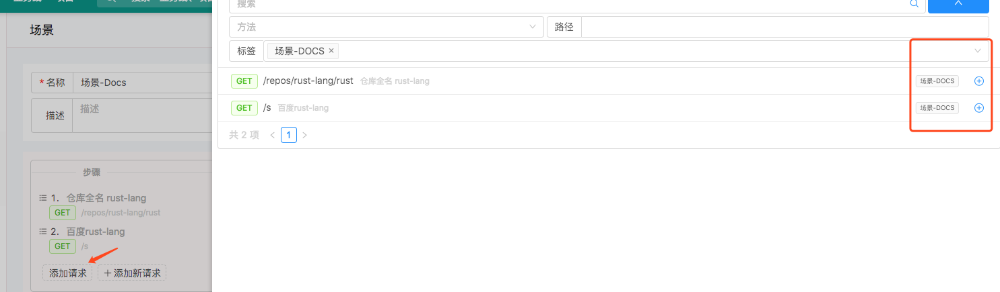
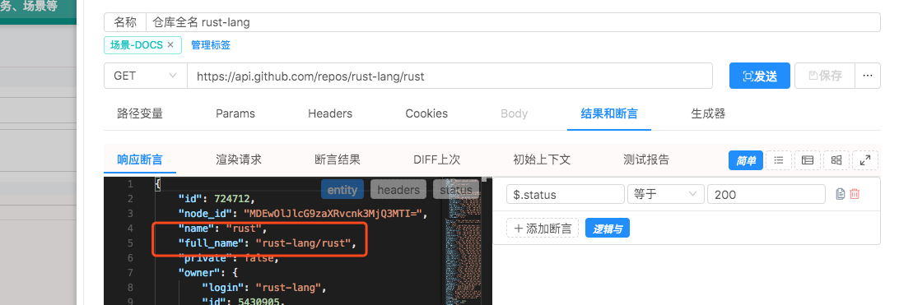
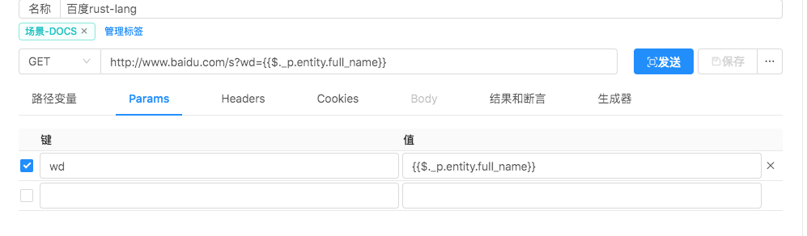

# 创建一个场景

## 1. 进入创建场景的界面

> 

## 2. 添加步骤

> 
> 选了两个步骤。

> 
> 这是第一个请求步骤，假设俺想在第二个请求里面使用这个 `full_name` 的值进行百度检索。

> 
> 这是第二个请求步骤。 `{{$._p.entity.full_name}}`，用`{{` 和 `}}`指示要用[上下文](/zh-cn/context)中的数据进行渲染或执行脚本。`$._p.entity.full_name` 指 `上下文根对象`.`上一个步骤`.`的消息体`.`full_name字段值`。

## 3. 测试&新建

> 点击 `测试` 按钮，就可以看到以下步骤二请求中被渲染的值。

> 
> 
