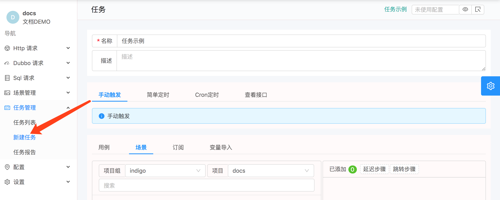
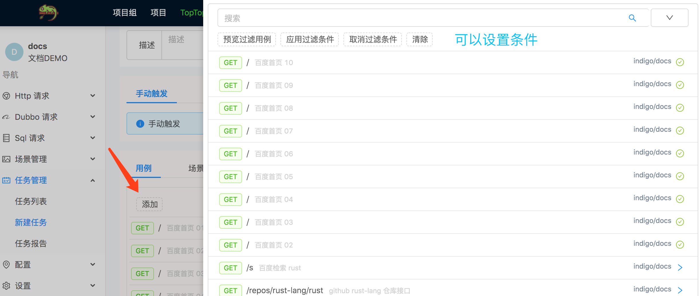
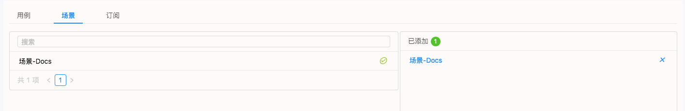
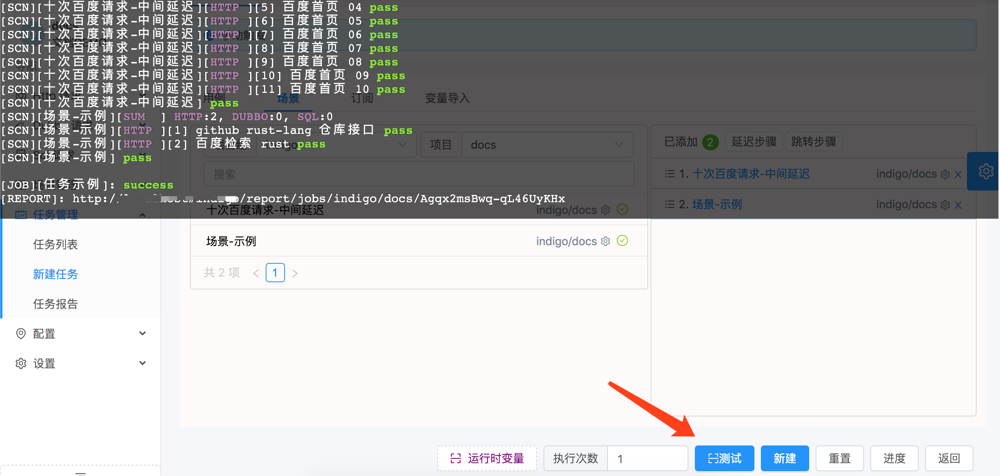
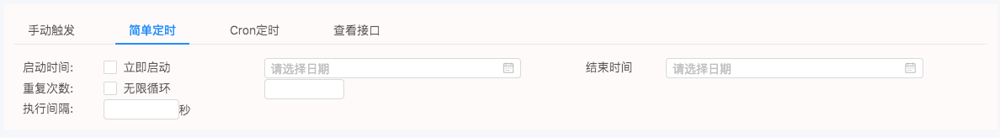
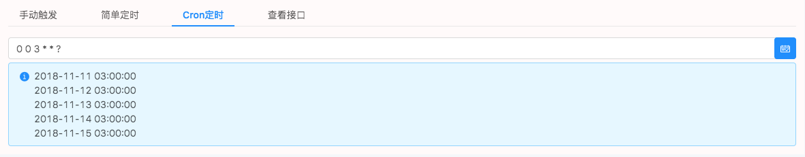
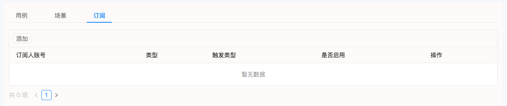
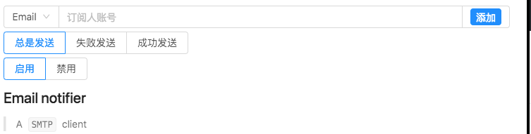
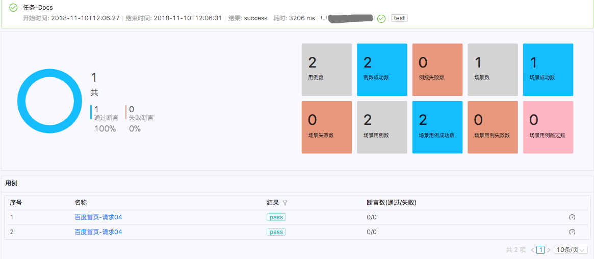
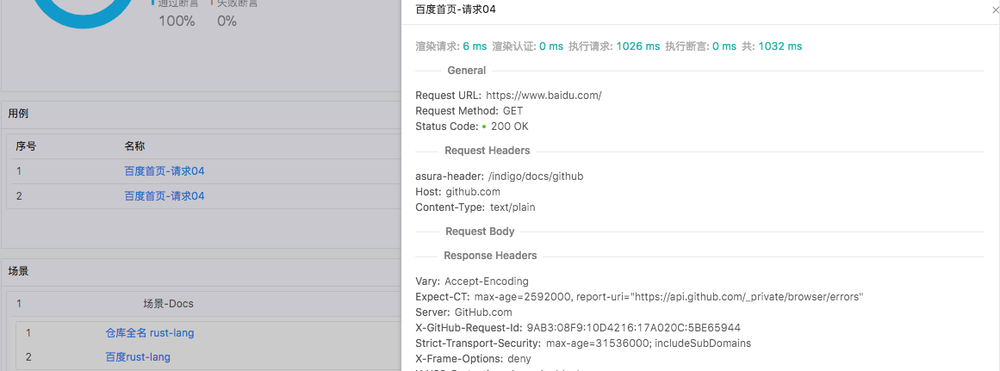

# 创建一个任务

## 1. 进入创建任务的界面
> 

## 2. 添加独立的请求

> 

## 3. 添加场景
> 

## 4. 测试&创建
> 

## 5. 添加触发器

### 简单类型
> 

### Cron 定时
> 

## 6. 添加订阅用户
> 任务执行完成后可以触发指定类型的通知事件
> 
> 

## 7. 通过API调用
> 任务都可以通过API调用，`http://host:port/api/ci/job/{jobId}`, `jobId` 参数填写生成的任务ID。

## 8. 查看报告
> 统计数据, 任务的历史趋势图
> 

> 每次请求的详细数据
> 
