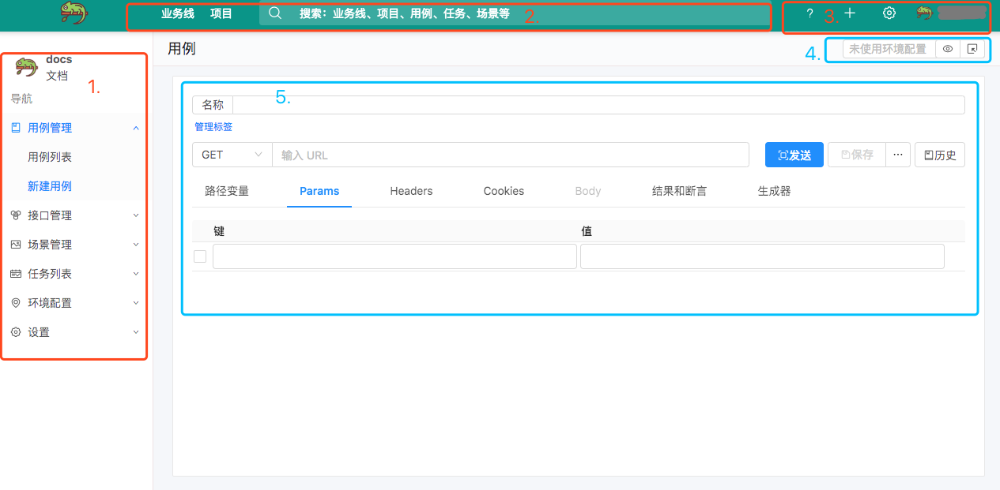
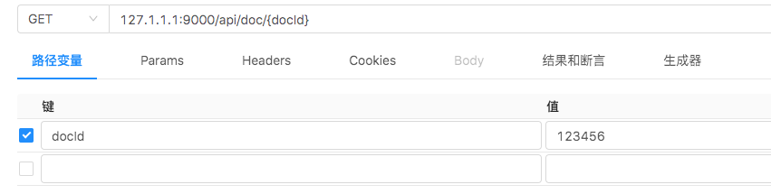
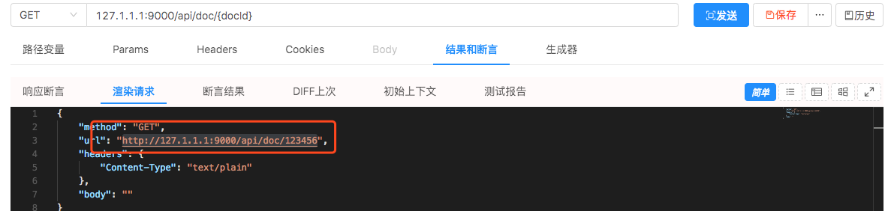
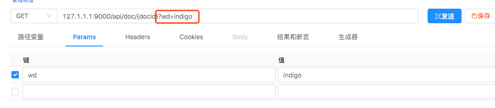
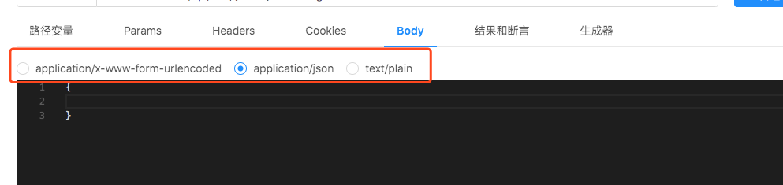
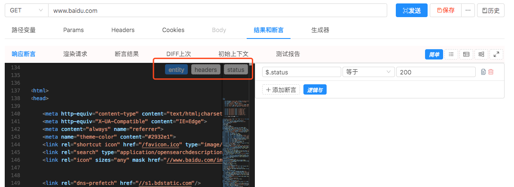
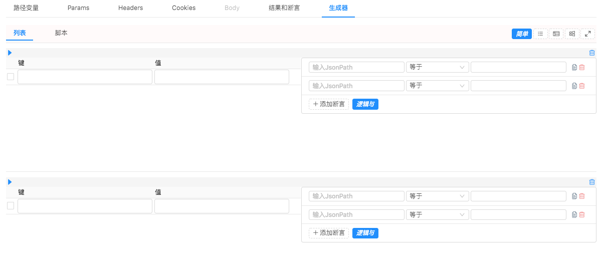

# 用户界面

## 请求主页面

> `docs` 这个项目的创建用例请求的主界面
> 
> 1. 菜单
> 2. 顶部导航和搜索
> 3. 帮助、新建、设置按钮
> 4. 环境配置查看和选择
> 5. 用例模板编辑面板

## 方法和URL

> 例，url: `127.1.1.1:9000`

## 路径变量

> 路径变量指的 url 中的路径部分的变量。如 `127.1.1.1:9000/api/doc/{docId}`，用`{`和`}`包起来
> 
> 执行渲染后的请求是
> 

## Params

> URL 中的 `query(也叫 search, ?后面的)` 部分
> 

## Headers

> 请求头

## Cookies

> 请求的 `cookie`

## Body

> 支持以下三种 contentTypes
> 

## 结果和断言

> 点击一下 `发送`，就可以看到 `响应体(entity)`，`响应头(headers)`，`响应码(status)` 。右边可以添加断言。
> 

## 生成器

> 因为用例请求是个模板，可以填写N组变量值和断言，在执行时渲染成N个请求。`现在只是个原型图，有过度设计嫌疑，后端未实现`。
> 

